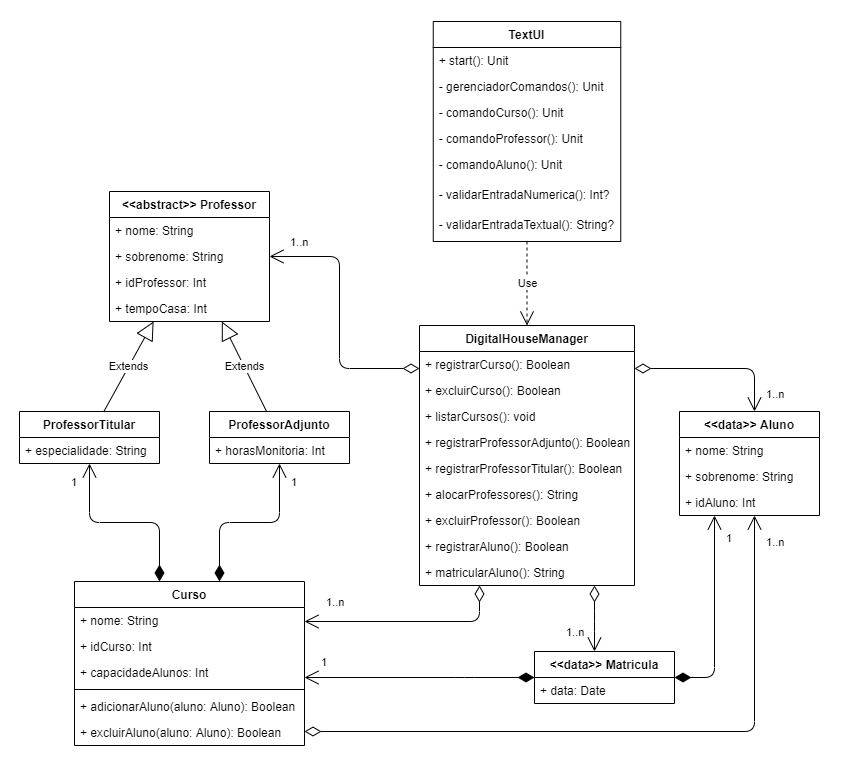

# Desafio Kotlin Digital House

Solução do Desafio Kotlin proposto durante o curso de Desenvolvimento Mobile Android da Digital House oferecido pelo programa Santander Coders.

O desafio consiste em criar um diagrama e implementar classes de acordo com requerimentos específicos passados em aula.

### Diagrama UML

